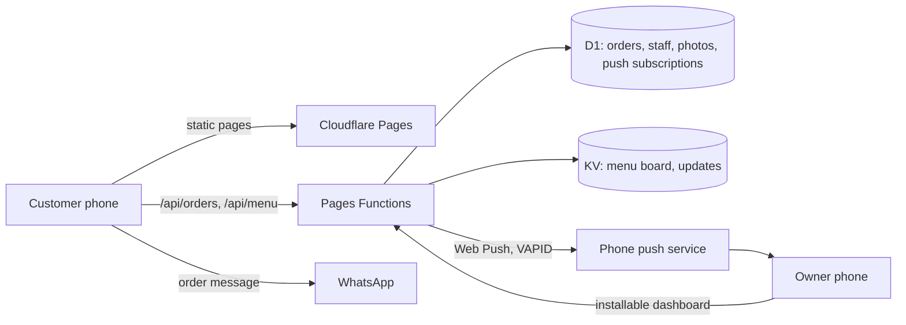

# Bullhead Hotel & Butchery

A complete ordering system for a two-counter hotel and butchery on the Nairobi–Mombasa road in Emali, Kenya: a fast mobile-first website, online ordering that hands off to WhatsApp, live order tracking for customers, and an installable owner dashboard that buzzes the owner's phone when an order arrives.

**Live:** [bullheadhotels.co.ke](https://bullheadhotels.co.ke) · Delivered to and used by the owner.

<!--
Screenshots: add three images to docs/screenshots/ and uncomment.


-->

## What it does

**For customers**
- Browse the menu, build a plate (some items are sold per kg in 0.5 kg steps) and send the order straight to WhatsApp. The order is recorded first and both sides carry the same short code, e.g. `#K7Q2M`.
- Track the order live on a tracking page: received, preparing, ready.
- Scan a table QR code to order from the table. Dine-in orders go straight to the kitchen.
- English and Swahili, M-Pesa pay-ahead details, opening hours, directions and a photo gallery.
- Installable as an app, with an offline fallback page.

**For the owner and staff**
- Installable dashboard on the owner's phone. New orders trigger a phone alert and a chime.
- Orders move through `unconfirmed → new → preparing → ready → done`. Staff confirm an order by matching its code against the WhatsApp message.
- Edit the menu board live: change prices, mark items sold out until a time, add dishes, set specials. Post notices to the "updates" bar, with a button that drafts them in Swahili.
- Daily sales and insights, a photo gallery manager, printable table-QR posters, and separate staff logins limited to their own branch.
- Two branches on one codebase: `branch1.` and `branch2.` sites with their own canonical URLs, search data, menu board and phone alerts.

## How it is built



- **No framework, no build step, no npm dependencies.** Plain HTML, CSS and JavaScript on Cloudflare Pages, with serverless API routes in `functions/`. Cloudflare's free plan covers all of it.
- **Storage:** D1 (SQLite) for orders, staff, photos and push subscriptions. KV for the menu board and notices. Tables create themselves on first use.

### Engineering details worth a look

- **The server never trusts the browser's prices.** `functions/api/orders.js` imports the same price list as the site and works out every total itself.
- **Phone alerts are implemented by hand.** `functions/api/push.js` signs VAPID tokens with the Web Crypto API and sends the push directly, with no library. Subscriptions that the push service reports as gone are removed, and failed deliveries are logged with the reason.
- **Per-branch search data without a build step.** `functions/_middleware.js` uses `HTMLRewriter` to give each branch address its own canonical URL, title, `Restaurant` structured data, sitemap, robots file and web manifest.
- **Menu structured data that cannot go stale.** The `/menu` page gets a schema.org `Menu` block generated on each request from the default price list plus the owner's saved board (price changes, sold-out items, added dishes), so search engines read what customers see.
- **Private pages stay private.** The owner pages return a 404 on the public site and are served only on a separate admin hostname, with `noindex` headers. The owner can change the access code from the dashboard. It is stored as a salted hash and replaces the deployment secret.
- **Abuse limits and privacy by default.** Public writes are rate limited. Customer phone numbers, addresses and delivery pins are erased 30 days after an order, and the address fingerprint used for rate limiting is erased after a day.
- **Written for the free tier.** Static assets are kept out of the Functions request count, pages stop polling when hidden, and KV is written only when the owner saves.

## Project layout

```
bullhead-site/    the website and the owner dashboard (Cloudflare Pages build output)
  js/             page scripts, menu data, cart, admin dashboard
  css/            styles
functions/        serverless API and middleware
  api/            orders, menu, push, staff, settings, summary, updates, photos
  _lib/           auth, branches, menu structured data
```

Setup, bindings, secrets, branch sites and free-tier limits are in [`bullhead-site/SETUP.md`](bullhead-site/SETUP.md).

## Built by

Ricky ([@Ricky112-creator](https://github.com/Ricky112-creator)) — design, development and delivery for the client.
